# BoxBox - F1 Strategy Intelligence Dashboard

_"Because some pit walls need help"_

**BoxBox** is what your pit wall radios say when it's time to pit - the term became something of a meme thanks to Ferrari's chaotic strategy calls over the years. This project is a data-driven attempt to make that call the right one, every time.

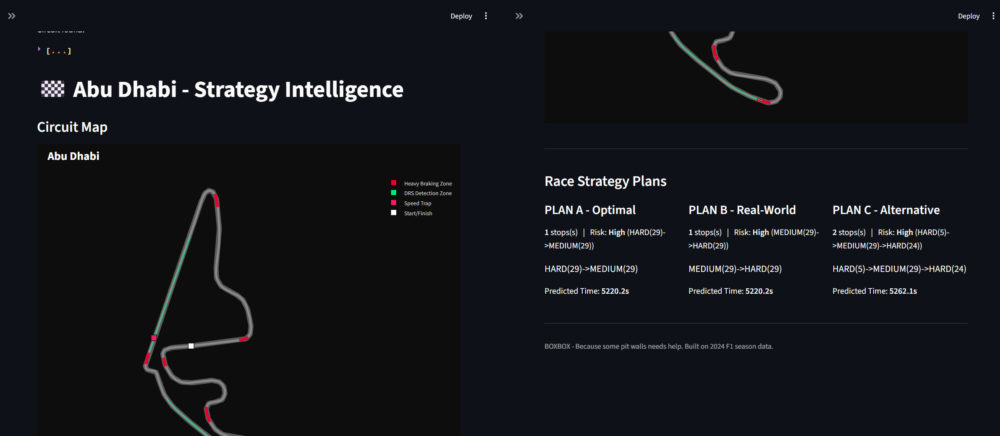

---

## What It Is

A full stack F1 Strategy Intelligence tool built entirely on real 2024 Formula 1 season data. It combines tire degradation modeling, survival analysis, machine learning, and an interactive Streamlit dashboard to answer the questions a real race strategist asks: Which tires, in what order, when to pit, and how risky is the plan.

**Live Capabilities:**

- Predicts tire degradation per circuit and compound using validated ML models
- Estimates tire "survival probability" using medical grade survival analysis techniques
- Generates three ranked strategy options A/B/C per circuit, each with a calculated risk score
- Visualizes everything through a dark-themed, interactive dashboard with real circuit maps, DRS/Braking zones, and turn-by-turn markers.

---

## The Pipeline - 9 Phases

| Phase                              | What It Does                                                                                                                      |
| ---------------------------------- | --------------------------------------------------------------------------------------------------------------------------------- |
| 1 - Data collection                | Pulls the complete 2024 F1 season via FastF1: lap timing, pit stops, race results, weather, circuit telemetry                     |
| 2 - Cleaning & Feature Engineering | Removes pit/safety-car/outlier/ laps; engineers 10 feature (fuel-corrected pace, stint progress, compound age ratio, etc.)        |
| 3 - Degradation Modeling           | Trains Polynomial, Ridge, and Random Forest per circuit/compound; cross-validated RMSE picks the winner                           |
| 4 - Survival Analysis              | Kaplan-Meier survival curves + Cox Proportional Hazard models - borrowed from medical/reliability statistics                      |
| 5 - Strategy Optimization          | Simulates every realistic 1-stop/2-stop strategy per circuit; outputs Plan A/B/C with risk scores                                 |
| 6 - ML Models                      | Six Purpose-built models: Stint Length, Compound Selector, Strategy, Pit Window, Circuit Clustering (K-Means), Undercut Viability |
| 7 - Anomaly Detection              | DBSCAN independently validates Phase 2's manual data cleaning                                                                     |
| 8 - Circuit Map Builder            | Builds broadcast-style circuit maps from real GPS telemetry - braking zones, DRS zones, turn markers, speed trap                  |
| 9 - Dashboard                      | Four-page interactive Streamlit application tying everything together                                                             |

---

## The Dashboard

### Page 1 - Circuit Intelligence

_"All the screenshots shown of analysis are for Abu Dhabi circuit"_

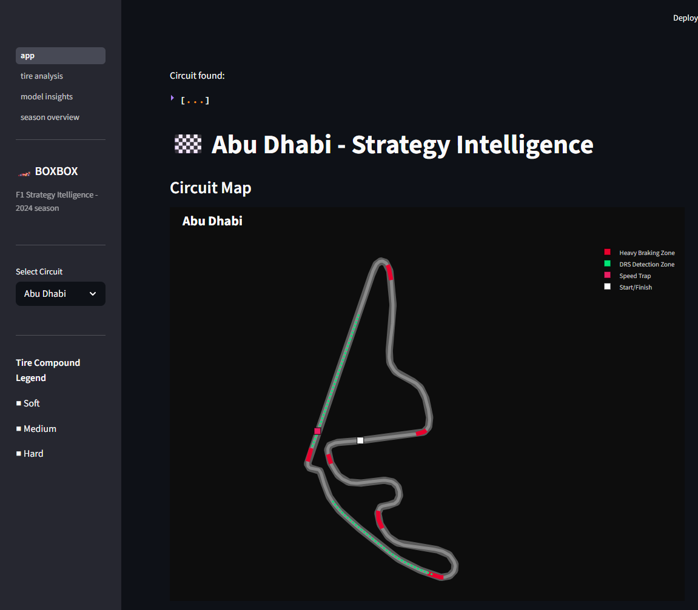

Interactive circuit map (smoothed track outline, solid red braking zones, dashed green DRS zones offset outside the track, auto-detected numbered turns, speed trap and start/finish markers) alongside Plan A/B/C strategy cards - each showing stop count, compound sequence, predicted race time, and a color-coded risk badge (Low/Medium/High).

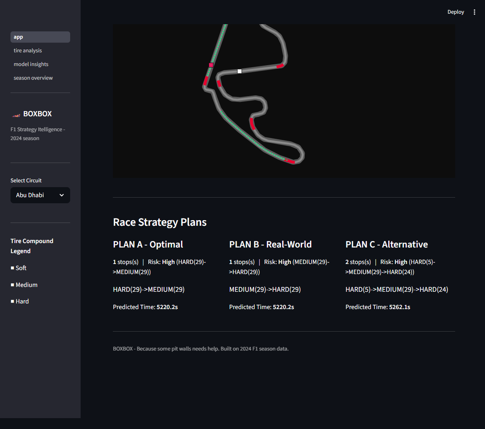

### Page 2 - Tire Analysis

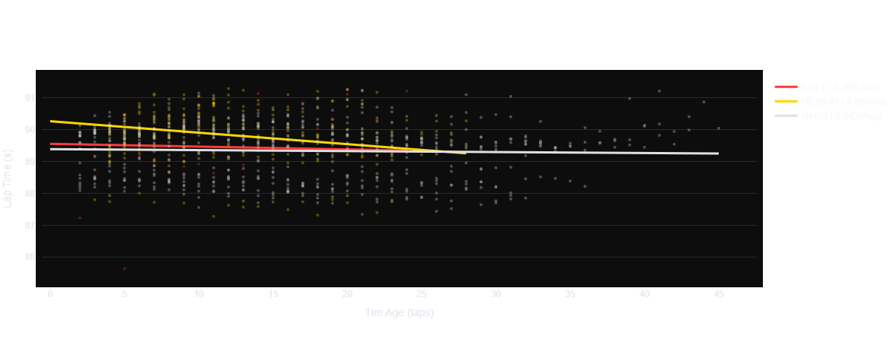

Degradation Curves - predicted lap time vs. tire age, per compound, with regression slopes

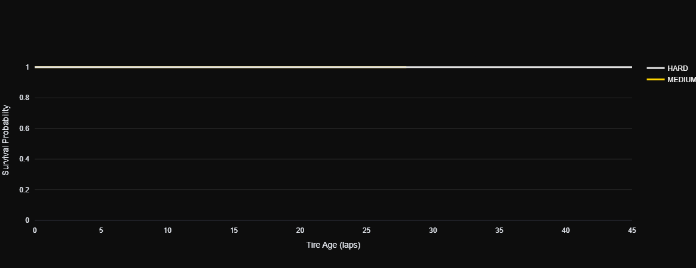

Kaplan-Meier survival curves with confidence bands

Here Medium and Hard Tyres completely overlap each other, and Soft tyres probability was not acquired cause of insufficient data

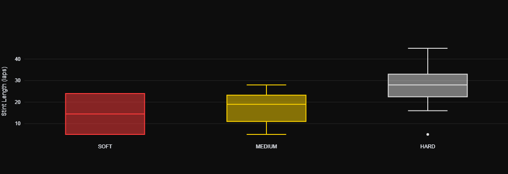

Real World Stint Length Distribution (box plots)

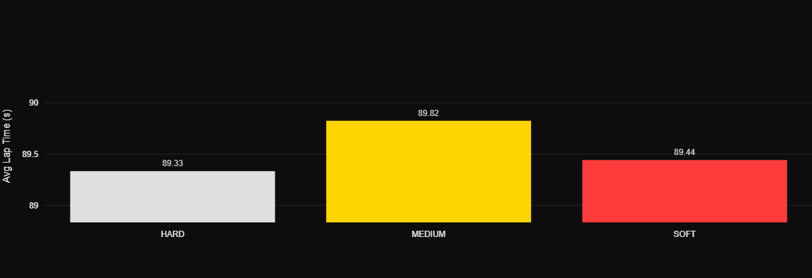

### Model Insights

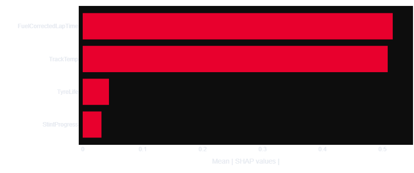

SHAP feature Importance - what actually drives degradation at each circuit

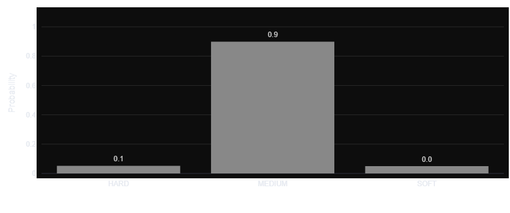

Compound Selector Confidencee, with interactive stint-number slider

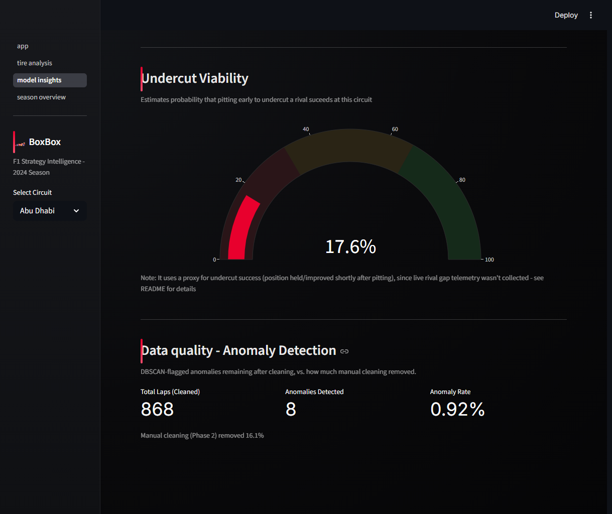

Undercut Viability gauge and DBSCAN Anomaly Detection

(These graphs are different for all 23 races, and can be accessed via the dashboard, here only the metrics and graphs of Abu Dhabi is shown)

(As these project is focused more on Dry Compounds set(SOFT, MEDIUM, HARD), **Brazil has no data as in 2024, it was a full WET COMPOUND race**)

### Page 4 - Season Overview

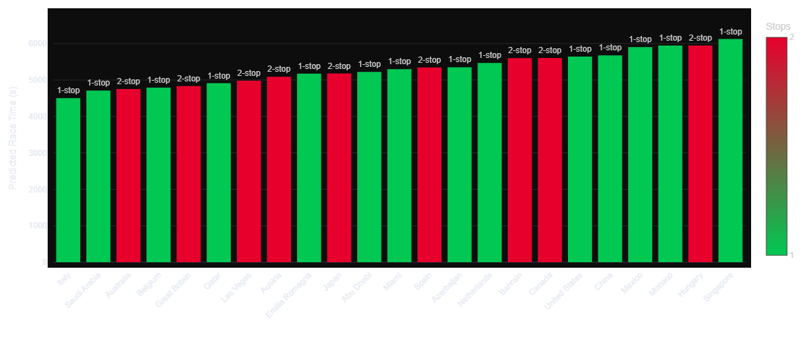

Full Season Strategy Landscape (1-stop vs. 2-stop by circuit)

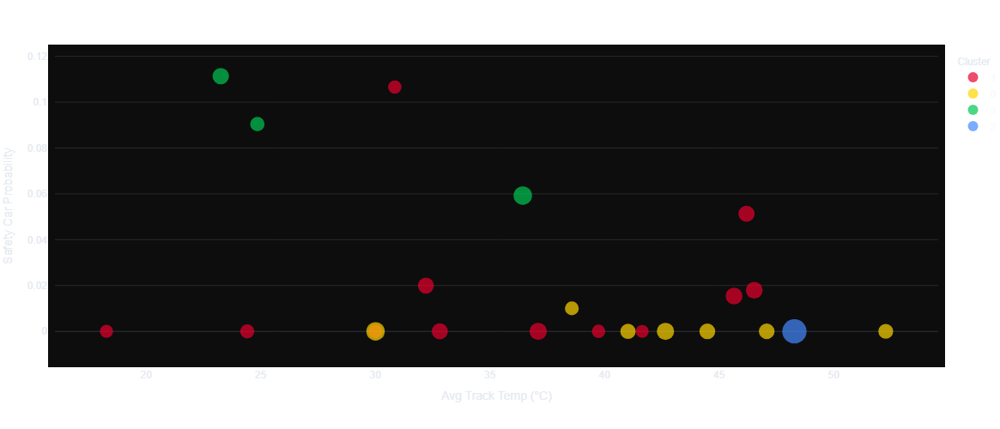

K-Means circuit cluster scatter plot

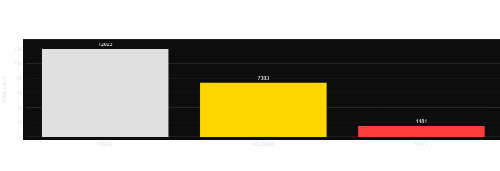

Season-wide compound usage frequency

---

## Key Findings

**Model selection isn't one-size-fits all** Random Forest won 39 of 59 circuit/compound degradation models, Ridge Regression won in 20, Polynomial won none - tire degradation is often non-linear, but genuinely linear at some circuits. Letting Cross Validation RMSE choose the model per circuit beat assuming one formula everywhere.

**Canada 2024 was a genuine data outlier and two independent methods agree on it** 80% of Canada's raw laps were removed during manual cleaning due to heavy Safety Car/VSC disruption. Phase 7's DBSCAN anomaly detection - a complete separate, unsupervised method - independently flagged Canada as one of the messiest races in the season, cross-validating the manual cleaning decision.

**Cox Hazard models revealed real, statistically significant, circuit-specific risk drivers** Emilia Romagna and netherlands show fuel corrected pace as the dominant tire-failure risk factor (hazard ratio ≈ 2.1-2.2, p < 0.01); Austria's dominance factor is the track temperature instead.

**Risk scores across circuits show genuine, validated variation** After fixing two upstream bugs (a Safety Car Probability calculation that was silently returning Zero for every circuit, and a Cox model that was failing to fit due to a colum-name mismatch), Plan A risk scores spans a real range from 9.6 (Belgium, lowest risk) to 24.2 (Great Britain, highest risk) - with a healhty spread of Low/Medium/High classification across the season rather than one flat bucket.

**Model accuracy is context-dependent, and that's disclosed rather than hidden** The Compound Selector, Strategy Outcome, and Undercut classifiers land in the 68-77% accuracy range - meaningfully lower than whats's acheivable on a deterministic physics problem, because F1 strategy also involves human decisions, competitor behavior, and genuine random (teamates, rival's errors, safety car timing) rather than fixed physical laws. this is treated as the understanding the problem's inherent noise ceiling, not a modeling flaw.

**The 2024 Sao Paulo Grand Prix (Brazil) is intentionally excluded** The race was run entirely under wet-weather conditions - zero laps on dry compounds (SOFT/MEDIUM/HARD) - placing it outside this project's dry-tire degradation and strategy scope.

---

### Known Limitations

- **Undercut Viability Classifier uses a documented proxy** True rival-vs-rival gap telemetry wasn't collected in Phase 1, so the model instead uses whether track position held or improved shortly after a pit stop as a stand-in signal. This is a real limitation, not full undercut modeling.
- **Compound Selector and Undercut demo predictions use representative inputs** (e.g., a chosen stint number, a mid-field grid position) rather than live race state, since this is a strategy reference tool, not a live-race feed.
- **DBSCAN flagged residual data-quality anomalies** (~1.5% of cleaned laps) most heavily in Japan, Australia, Spain, Azerbaijan, and Great Britain - worth awareness if extending this analysis further.

---

## Tech Stack

- **Data Collection:** FastF1
- **Data Science:** pandas, numpy, scikit-learn, SHAO, lifelines (survival analysis)
- **Visualization:** Plotly
- **Dashboard:** Streamlit
- **Models:** Polynomial/Ridge Regression, Random forest Regression, Kaplan-Meier, Cox Propotional hazard, Gradient Boosting (classification & Regression), K-Means, DBSCAN, Logistic Regression

---

## Project Structure

```
boxbox/
├── docs/
│   └── screenshots/
│       ├── page1_circuit_intelligence.png
│       ├── circuit_map.png
│       ├── strategy_cards.png
│       ├── tire_analysis.png
│       ├── model_insights.png
│       └── season_overview.png
│
├── cache/                     (FastF1 cache — gitignored)
├── data/                      (raw/processed/outputs — gitignored, regenerated by running phases)
├── models/                    (trained .pkl models — gitignored, regenerated by Phase 3/4/6/7)
├── circuit_maps/               (Plotly JSON per circuit — gitignored, regenerated by Phase 8)
│
├── notebooks/
│   ├── phase1_collection.ipynb
│   ├── phase2_engineering.ipynb
│   ├── phase3_degradation.ipynb
│   ├── phase4_survival.ipynb
│   ├── phase5_optimizer.ipynb
│   ├── phase6_ml_models.ipynb
│   ├── phase7_anomaly_detection.ipynb
│   └── phase8_circuit_maps.ipynb
│
├── dashboard/
│   ├── app.py                  (Page 1 — Circuit Intelligence, entry point)
│   └── pages/
│       ├── 02_tire_analysis.py
│       ├── 03_model_insights.py
│       └── 04_season_overview.py
│
├── phases/
│   ├── phase1_collection.py
│   ├── phase2_engineering.py
│   ├── phase3_degradation.py
│   ├── phase4_survival.py
│   ├── phase5_optimizer.py
│   ├── phase6_ml_models.py
│   ├── phase7_anomaly_detection.py
│   └── phase8_circuit_maps.py
├── requirements.txt
├── .gitignore
└── README.md
```

---

## How to Run

```bash
# 1. Install dependencies
pip install -r requirements.txt

# 2. Phases 1-8 are Jupyter notebooks - open each one in order and run all top to bottom:
notebooks/phase1_collection.ipynb
notebooks/phase2_engineered.ipynb
notebooks/phase3_degradation.ipynb
notebooks/phase4_survival.ipynb
notebooks/phase5_optimizer.ipynb
notebooks/phase6_ml_models.ipynb
notebooks/phase7_anomaly_detection.ipynb
notebooks/phase8_circuit_maps.ipynb

# 3. Launch the dashboard
python -m streamlit run dashboard/app.py
```

**Note:** `data/`, `models/`, and `circuit_maps/` are gitignored since they're large and fully reproducible - clone the repo, run the notebooks in order, and everything regenrates locally.

## Data Coverage Note

The 2024 Sao Paulo Grand Prix is excluded from this analysis - the run was run under wet-weather conditions with no dry-compound laps recorded. All other 23 circuits from the 2024 Calendar are covered.
